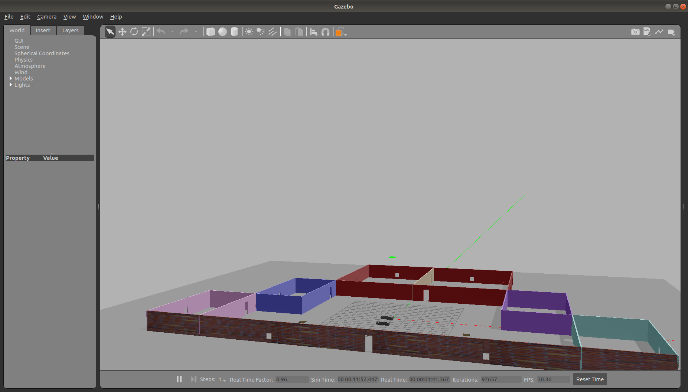

# BuildMyWorld

## Overview
This project is the first project in Udacity Robotics Software Engineer nano degree and it includes three important elements :  
	&emsp; &emsp; - A buliding that is shown in the photos above  
	&emsp; &emsp; - A robot model that is shown in the photos above  
	&emsp; &emsp; - A plugin that prints welcome to menna's world when running the world  

**Keywords:** Gazebo, Robotics, Udacity

**Author: Mennatallah Aly **

The PACKAGE NAME package has been tested under [ROS] Melodic on Ubuntu 18.04.

### Building from Source

#### Dependencies

- [Gazebo](https://gazebosim.org/home) (Simulation program)

#### Building

To build from source, clone the latest version from this repository 

	git clone https://github.com/ethz-asl/ros_best_practices.git

## Usage

Describe the quickest way to run this software, for example:

Run the main node with

	roslaunch ros_package_template ros_package_template.launch

## Config files

Config file folder/set 1

* **config_file_1.yaml** Shortly explain the content of this config file

Config file folder/set 2

* **...**

## Launch files

* **launch_file_1.launch:** shortly explain what is launched (e.g standard simulation, simulation with gdb,...)

     Argument set 1

     - **`argument_1`** Short description (e.g. as commented in launch file). Default: `default_value`.

    Argument set 2

    - **`...`**

* **...**

## Nodes

### ros_package_template

Reads temperature measurements and computed the average.

#### Subscribed Topics

* **`/temperature`** ([sensor_msgs/Temperature])

	The temperature measurements from which the average is computed.

#### Published Topics

...

#### Services

* **`get_average`** ([std_srvs/Trigger])

	Returns information about the current average. For example, you can trigger the computation from the console with

		rosservice call /ros_package_template/get_average

#### Parameters

* **`subscriber_topic`** (string, default: "/temperature")

	The name of the input topic.

* **`cache_size`** (int, default: 200, min: 0, max: 1000)

	The size of the cache.

### NODE_B_NAME

...

## Bugs & Feature Requests

Please report bugs and request features using the [Issue Tracker](https://github.com/ethz-asl/ros_best_practices/issues).

[ROS]: http://www.ros.org
[rviz]: http://wiki.ros.org/rviz
[Eigen]: http://eigen.tuxfamily.org
[std_srvs/Trigger]: http://docs.ros.org/api/std_srvs/html/srv/Trigger.html
[sensor_msgs/Temperature]: http://docs.ros.org/api/sensor_msgs/html/msg/Temperature.html
